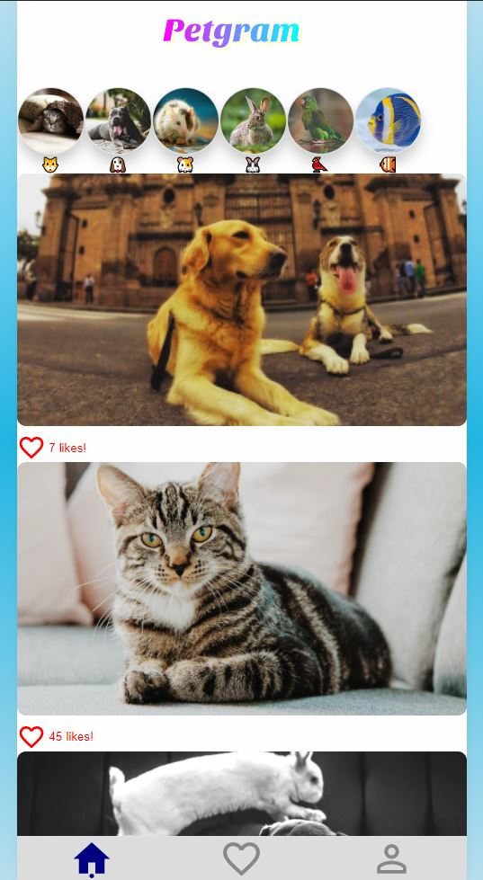

# Curso react avanzado ⚛️

## Petgram

 
URL:

Tecnologias utilizadas

-   Webpack
-   Babel
-   Styled-components
-   Linter standardJS
-   GraphQL
-   React Apollo
-   ReachRouter
-   Lighthouse
-   Cypress
-   React Helmet
-   Workbox
-   ProgressiveWebApp
-   Vercel

Repositorio con el código Base del [Curso Avanzado de React de Platzi](https://platzi.com/cursos/react-avanzado/)
